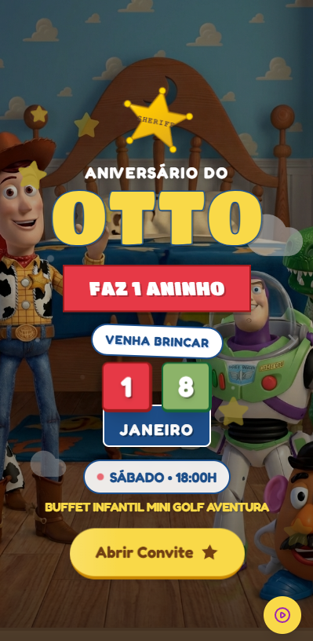

# Convite do Otto - 1 Ano

Um convite digital interativo para festa de 1 ano de aniversário com tema Toy Story.

## Visão Geral



Este é um aplicativo web React responsivo para o convite de aniversário de 1 ano do Otto. O app apresenta:
- Design temático de Toy Story com cores vibrantes e animações
- Navegação suave entre seções
- Galeria de fotos interativa
- Formulário de confirmação de presença (RSVP)
- Animações personalizadas usando Tailwind CSS

## Tecnologias

- **React 19** com TypeScript
- **Vite** como bundler e servidor de desenvolvimento
- **Tailwind CSS** com configuração customizada e tema Toy Story
- Componentes reutilizáveis com TypeScript

## Comandos de Desenvolvimento

```bash
# Instalar dependências
npm install

# Executar servidor de desenvolvimento (porta 3000)
npm run dev

# Build para produção
npm run build

# Visualizar build de produção
npm run preview
```

## Estrutura do Projeto

```
src/
├── components/          # Componentes de seção
│   ├── Header.tsx       # Barra de navegação
│   ├── Hero.tsx         # Seção principal
│   ├── About.tsx        # Sobre a festa
│   ├── InfoSection.tsx  # Detalhes da festa
│   ├── MapSection.tsx   # Mapa do local
│   ├── Gallery.tsx      # Galeria de fotos
│   ├── RSVP.tsx         # Formulário de RSVP
│   └── Footer.tsx       # Rodapé
├── components/ui/       # Componentes reutilizáveis
│   ├── Button.tsx       # Botão customizado
│   └── ScrollReveal.tsx # Wrapper para animações
├── App.tsx             # Componente principal
├── index.tsx           # Ponto de entrada
├── types.ts            # Definições de tipos TypeScript
└── main.css            # Estilos globais
```

## Configuração

### Variáveis de Ambiente

Crie um arquivo `.env.local` na raiz do projeto:
```
GEMINI_API_KEY=sua_chave_aqui
```

### Configuração do Vite

- Servidor de desenvolvimento na porta 3000
- Alias de caminho: `@/` aponta para a raiz do projeto
- Exposição da `GEMINI_API_KEY` como variável de ambiente

## Personalização

### Tema Tailwind

O tema Toy Story é configurado inline no `index.html` com:
- **Fontes**: Titan One (logo), Fredoka (títulos), Nunito (texto)
- **Cores**: toyBlue, toyLightBlue, toyYellow, toyRed, toyGreen, toyPurple, toyCloud
- **Animações**: float, bounce, spin, pop
- **Padrões**: nuvens e fundo de cow print

### Conteúdo

Todo o conteúdo de UI está em português (pt-BR) conforme o tema da festa. As fotos da galeria podem ser atualizadas modificando o array `galleryImages` no componente `Gallery.tsx`.

## Funcionalidades

- **Navegação responsiva** com menu mobile
- **Animações suaves** ao rolar a página
- **Galeria interativa** com visualização em lightbox
- **Formulário de RSVP** com estados de loading e feedback
- **Mapa integrado** com localização da festa
- **Design otimizado** para dispositivos móveis

## Deploy

O projeto está configurado para ser facilmente implantado em plataformas como Vercel, Netlify ou GitHub Pages através do comando `npm run build`.
